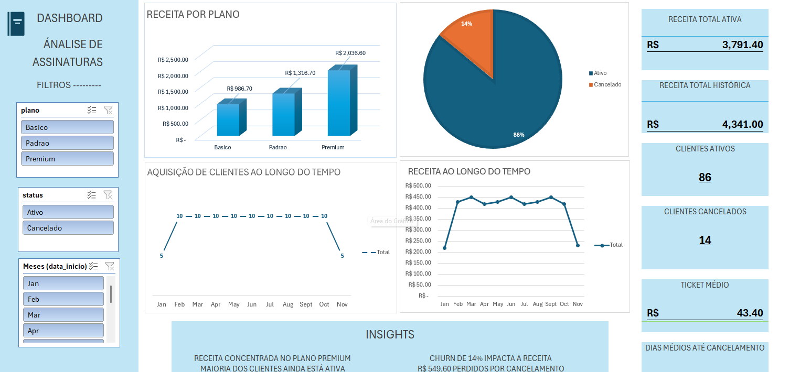

## 📊 Dashboard

📊 Análise de Assinaturas

Projeto de análise de dados focado em métricas de um negócio baseado em assinaturas, utilizando SQL e Excel para explorar comportamento de clientes, receita e churn.

## 🚀 Desenvolvimento do Projeto

Este projeto foi desenvolvido completamente do zero, incluindo:

- Modelagem da base de dados
- Criação e simulação dos dados
- Construção das queries em SQL
- Análise das métricas de negócio
- Desenvolvimento do dashboard no Excel

🎯 Objetivo

Analisar a base de clientes para entender:

Geração de receita
Retenção e cancelamentos (churn)
Distribuição por planos
Evolução da base ao longo do tempo
🛠 Ferramentas Utilizadas
SQL (PostgreSQL)
Excel (Tabelas Dinâmicas e Dashboard)
📁 Estrutura do Projeto
dashboard.xlsx → Dashboard final com visualizações e KPIs
queries.sql → Consultas utilizadas para análise
base_dados → Dados simulados de assinaturas
📊 Principais Métricas
💰 Receita Total Histórica: R$ 4.341,00
💵 Receita Ativa: R$ 3.791,40
👥 Clientes Ativos: 86
❌ Clientes Cancelados: 14
📉 Churn: 14%
🎯 Ticket Médio: R$ 43,40
⏳ Tempo Médio até Cancelamento: 94 dias
📈 Insights
💰 Receita concentrada no plano Premium
📉 Churn de 14% impacta o crescimento da base
💸 Cancelamentos geram perda de receita relevante
📈 Crescimento mais forte nos primeiros meses
👥 Maioria dos clientes permanece ativa (86%)
⚖️ Planos mais baratos concentram maior volume de clientes
📊 Visualizações

O dashboard apresenta:

Receita por plano
Clientes por status
Novos clientes por mês
Receita ao longo do tempo
KPIs principais do negócio
🧠 Conclusão

A análise mostra que, apesar de uma base majoritariamente ativa, o churn ainda impacta diretamente a receita.
Além disso, o plano Premium se destaca como principal fonte de faturamento, enquanto planos mais acessíveis concentram maior volume de clientes.
